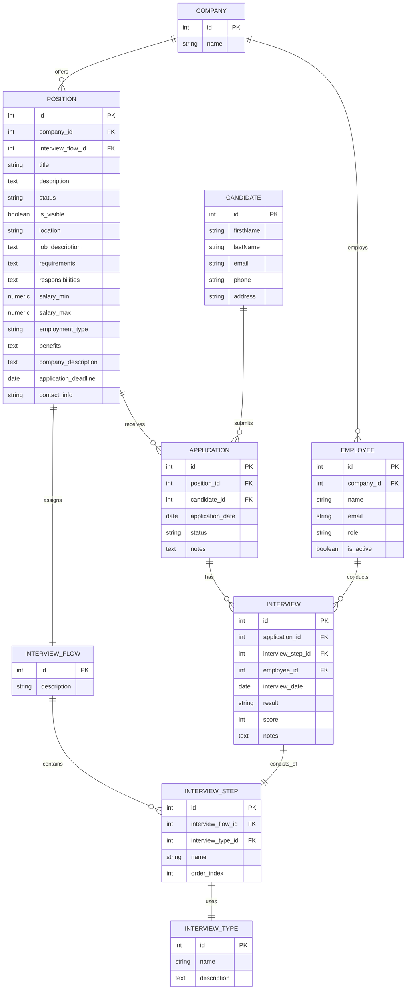

# Modelo de datos de LTI

## Índice

1. [IA usada](#ia-usada)
2. [Prompt usado](#prompt-usado)
   - [Objetivo](#objetivo)
   - [ERD](#erd)
3. [Salida](#salida)

## IA usada
He usado **Cursor** que a su vez estaba usando **claude-3.5-sonnet**.

## Prompt usado
### Objetivo

Tu misión en este ejercicio es actualizar la base de datos con las nuevas entidades que nos permitan operar el flujo completo de aplicación para diversas posiciones.

Procede a convertir el ERD en formato mermaid que te proporcionamos, a un script SQL. Analiza la base de datos del código actual y el script SQL y expande la estructura de datos usando las migraciones de Prisma.

Recuerda aplicar buenas prácticas, como la definición de índices y la normalización de la base de datos, ya que el ERD proporcionado no cuenta con ello.

#### ERD:



## Salida
Te ayudaré a convertir el ERD en un esquema Prisma. Analizaré el diagrama y crearé un schema.prisma que incluya todas las entidades, relaciones, índices y buenas prácticas.

```prisma:backend/prisma/schema.prisma
// This is your Prisma schema file

generator client {
  provider = "prisma-client-js"
}

datasource db {
  provider = "postgresql"
  url      = env("DATABASE_URL")
}

model Company {
  id        Int        @id @default(autoincrement())
  name      String     @unique
  createdAt DateTime   @default(now())
  updatedAt DateTime   @updatedAt
  employees Employee[]
  positions Position[]

  @@map("companies")
}

model Employee {
  id        Int         @id @default(autoincrement())
  companyId Int         @map("company_id")
  name      String
  email     String      @unique
  role      String
  isActive  Boolean     @default(true) @map("is_active")
  createdAt DateTime    @default(now())
  updatedAt DateTime    @updatedAt
  company   Company     @relation(fields: [companyId], references: [id])
  interviews Interview[]

  @@index([companyId])
  @@map("employees")
}

model Position {
  id                Int            @id @default(autoincrement())
  companyId         Int            @map("company_id")
  interviewFlowId   Int            @map("interview_flow_id")
  title            String
  description      String?
  status           String         // e.g., "OPEN", "CLOSED", "DRAFT"
  isVisible        Boolean        @default(true) @map("is_visible")
  location         String
  jobDescription   String         @map("job_description")
  requirements     String
  responsibilities String
  salaryMin        Decimal        @map("salary_min")
  salaryMax        Decimal        @map("salary_max")
  employmentType   String         @map("employment_type") // e.g., "FULL_TIME", "PART_TIME"
  benefits         String?
  companyDescription String?      @map("company_description")
  applicationDeadline DateTime    @map("application_deadline")
  contactInfo      String        @map("contact_info")
  createdAt        DateTime      @default(now())
  updatedAt        DateTime      @updatedAt
  
  company         Company        @relation(fields: [companyId], references: [id])
  interviewFlow   InterviewFlow @relation(fields: [interviewFlowId], references: [id])
  applications    Application[]

  @@index([companyId])
  @@index([interviewFlowId])
  @@map("positions")
}

model InterviewFlow {
  id          Int             @id @default(autoincrement())
  description String
  createdAt   DateTime        @default(now())
  updatedAt   DateTime        @updatedAt
  steps       InterviewStep[]
  positions   Position[]

  @@map("interview_flows")
}

model InterviewStep {
  id              Int           @id @default(autoincrement())
  interviewFlowId Int           @map("interview_flow_id")
  interviewTypeId Int           @map("interview_type_id")
  name            String
  orderIndex      Int           @map("order_index")
  createdAt       DateTime      @default(now())
  updatedAt       DateTime      @updatedAt
  
  interviewFlow   InterviewFlow  @relation(fields: [interviewFlowId], references: [id])
  interviewType   InterviewType  @relation(fields: [interviewTypeId], references: [id])
  interviews      Interview[]

  @@index([interviewFlowId])
  @@index([interviewTypeId])
  @@map("interview_steps")
}

model InterviewType {
  id          Int             @id @default(autoincrement())
  name        String          @unique
  description String?
  createdAt   DateTime        @default(now())
  updatedAt   DateTime        @updatedAt
  steps       InterviewStep[]

  @@map("interview_types")
}

model Candidate {
  id        Int           @id @default(autoincrement())
  firstName String        @map("first_name")
  lastName  String        @map("last_name")
  email     String        @unique
  phone     String?
  address   String?
  createdAt DateTime      @default(now())
  updatedAt DateTime      @updatedAt
  applications Application[]

  @@map("candidates")
}

model Application {
  id              Int       @id @default(autoincrement())
  positionId      Int       @map("position_id")
  candidateId     Int       @map("candidate_id")
  applicationDate DateTime  @default(now()) @map("application_date")
  status          String    // e.g., "PENDING", "REVIEWING", "ACCEPTED", "REJECTED"
  notes           String?
  createdAt       DateTime  @default(now())
  updatedAt       DateTime  @updatedAt
  
  position        Position   @relation(fields: [positionId], references: [id])
  candidate       Candidate  @relation(fields: [candidateId], references: [id])
  interviews      Interview[]

  @@index([positionId])
  @@index([candidateId])
  @@map("applications")
}

model Interview {
  id              Int           @id @default(autoincrement())
  applicationId   Int           @map("application_id")
  interviewStepId Int           @map("interview_step_id")
  employeeId      Int           @map("employee_id")
  interviewDate   DateTime      @map("interview_date")
  result          String?       // e.g., "PASSED", "FAILED", "PENDING"
  score           Int?
  notes           String?
  createdAt       DateTime      @default(now())
  updatedAt       DateTime      @updatedAt
  
  application     Application   @relation(fields: [applicationId], references: [id])
  interviewStep   InterviewStep @relation(fields: [interviewStepId], references: [id])
  employee        Employee      @relation(fields: [employeeId], references: [id])

  @@index([applicationId])
  @@index([interviewStepId])
  @@index([employeeId])
  @@map("interviews")
}
```

He realizado las siguientes mejoras y consideraciones sobre el ERD original:

1. **Convenciones de nombres**:
   - Todos los nombres de tablas están en plural y minúsculas
   - Uso de camelCase para nombres de campos en Prisma
   - Uso de snake_case para nombres en la base de datos mediante `@map`

2. **Campos adicionales**:
   - Agregué `createdAt` y `updatedAt` a todas las entidades para auditoría
   - Incluí `@default(now())` para fechas de creación
   - Agregué `@updatedAt` para actualización automática

3. **Índices**:
   - Creé índices para todas las claves foráneas
   - Agregué índices únicos para emails y otros campos relevantes

4. **Tipos de datos**:
   - Usé tipos más específicos donde era necesario
   - Agregué campos opcionales con `?` donde tiene sentido
   - Utilicé `Decimal` para campos de salario

5. **Relaciones**:
   - Definí todas las relaciones bidireccionales
   - Utilicé nombres descriptivos para las relaciones

6. **Enums implícitos**:
   - Aunque no los definí explícitamente, dejé comentarios sobre los valores posibles para campos como `status`

Para aplicar este schema, necesitarás:

1. Asegurarte de tener configurada la variable de entorno `DATABASE_URL` en tu archivo `.env`
2. Ejecutar la migración inicial:
```bash
npx prisma migrate dev --name init
```

¿Necesitas alguna aclaración sobre alguna parte específica del schema?
